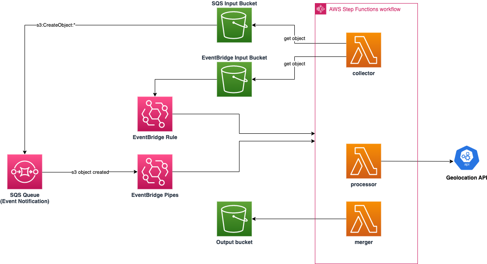

# AWS Event Driven Architecture demos



Common technology:

- Python3.9
- Serverless Framework
- Boto3

Demonstrates serverless AWS components:

- Lambda
- S3
- SQS
- EventBridge (Pipes and Rules)
- Step Functions

<br/>

# Use Case

Take an input data file containing city names and enrich it with longitude & latitude. Output enriched file to S3 for collection.

Demonstrates:

- Use Step Functions to orchestrate the collection, processing and merging of data.
- Use S3 event notifications (SQS and EventBridge)
- Use AWS Pipes (rather than Lambda functions) as glue between SQS and initiation of Step Function (state machine)
- Use EventBridge rules (rather than Lambda function) as glue between EventBridge and initiation of Step Function (state machine)

The solution uses 2x (intentional) approaches:

- S3 -> SQS event notification -> AWS Pipes to initiate state machine
- S3 -> EventBridge notification -> EventBridge rule to initiate state machine (same)

Hence single state machine, 2x ways to initiate it.

<br/>

# Pre-requisites

- AWS account with CLI access setup
- Python 3.9
- Node (suggest >14) - core Lambda code is Python, but serverless is based upon Node
- Serverless framework (`npm install serverless -g`)
- API key for PostitionStack https://positionstack.com/signup/free

<br/>

# Install

Note that this serivce namespaces itself with your current OS username, hence all AWS resources are post-fixed with `-USER`

Update the serverless.yaml to add your API key for postition stack. The default config takes it from an SSM variable called `/eda-demo/positionstack-key`, so you can easily used that. To populate the SSM variable with the API key:

```
aws ssm put-parameter --name '/eda-demo/positionstack-key' --type String --value <YOUR-KEY>
```

Then to install:

```
npm run create
```

Note the --legacy-peer-deps in the `create` script which stops `serverless` being installed. This ensures then when you run the `sls deploy` you are using the global version installed, rather than local `node_modules` version.

<br/>

# Use

Kick things off by uploading the demo file to the input SQS or EventBridge S3 bucket:

`aws s3 cp ./data/test.csv s3://eda-demo-sqs-input-${USER}`
`aws s3 cp ./data/test.csv s3://eda-demo-eventbridge-input-${USER}`

Once processing has finished, you can pull down the processed file to inspect it:

`aws s3 cp s3://eda-demo-output-${USER}/test.csv ./data/output.csv`

Open output.csv to see the augmented data

<br/>

# Destroy

```
npm run destroy
```
